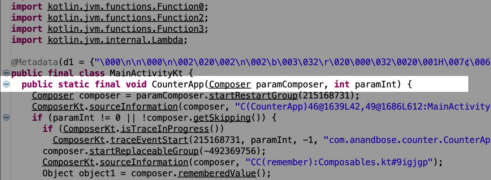
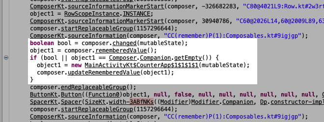
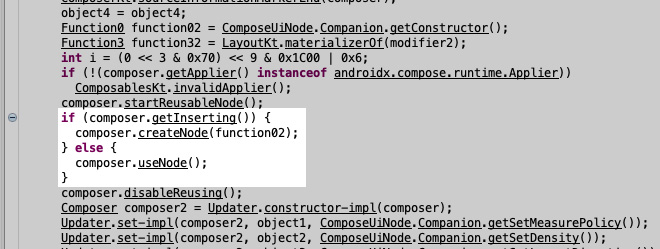
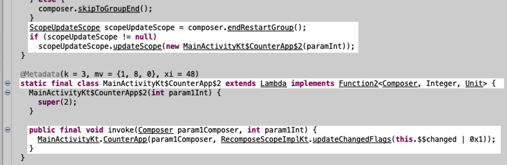

Jetpack Compose is the modern technology built upon the solid foundation of Kotlin, which enables us 
to express the UI in a declarative way. The compose compiler abstracts and keeps us away from the heavy
and complicated state management. In short, with Compose, we can express UI as a function of the
underlying state and Compose compiler will do the rest for us.

The following questions came to my mind when I started learning Compose.

1. How Compose do the state management under the hood?
2. Why `@Composable` functions are not callable from outside of the compose world?
3. How Compose *remembers* the state even if it has a functional approach?

The documentation somewhat answers these questions, however I took a *reverse engineering* approach to
have a deep understanding of these points. For achieving that, I made a simple counter app in Compose.

```kotlin
@Composable
fun CounterApp() {
    var count by remember {
        mutableStateOf(0)
    }
    Column(modifier = Modifier.padding(8.dp)) {
        Text(
            text = count.toString(),
            fontSize = 56.sp,
            modifier = Modifier.align(Alignment.CenterHorizontally)
        )
        Row(modifier = Modifier.align(Alignment.CenterHorizontally)) {
            Button(onClick = { count += 1 }) {
                Text(text = "Increment")
            }
            Spacer(modifier = Modifier.width(8.dp))
            Button(onClick = { count -= 1 }) {
                Text(text = "Decrement")
            }
        }
    }
}
```

This is how the app looks like:

import AppVideoWebm from "./app_video.webm"
import AppVideoMp4 from "./app_video.mp4"

<video width="100%" lazy controls alt="The video of the simple counter app with twobuttons for incrementing and decrementing value.">
    <source src={AppVideoWebm} type="video/webm"/>
    <source src={AppVideoMp4} type="video/mp4"/>
</video>

For the sake of simplicity, let's keep this functional model in the mind:
```
CounterApp():
    Column(...)
        Text(...)
        Row(...)
            Button(...)
            Spacer(...)
            Button(...)
```
## Reverse Engineering Compose app

To decompile the app, I used [dex2jar](https://github.com/pxb1988/dex2jar) for decompiling APK file,
and [jd-gui](https://github.com/java-decompiler/jd-gui) for decompiling JAR to human-readable source.

```shell
user@host:~$ ./dex-tools-2.1/d2j-dex2jar.sh app-debug.apk 
dex2jar app-debug.apk -> ./app-debug-dex2jar.jar

user@host:~$ java -jar ./jd-gui-1.6.6-min.jar app-debug-dex2jar.jar
```
In the JD-GUI window, navigate to the `MainActivityKt.class` file and look for the `CounterApp()` method.
There we found that strangers in the party! -- the `Composer paramComposer` and `int paramInt`.



These parameters injected by the compose compiler needs more explaination. The compose framework encourages
the developer to have functional approach to the UI, instead of the object oriented *"View"* like approach.
But the functional approach have some drawbacks, in the context of building UI:

* The functions are called exactly in the order in the call stack.
* They are called on the same thread of the caller, unless caller spawns a new thread for executing them.
* The executed functions will not be executed later, unless they are called again.

These limitations needs to be resolved to develop a UI framework with the functional approach. That's why
the Compose compiler injects these parameters. The compose compiler wraps the `@Composable` tree within
**restart groups**, **replaceable groups**, **movable groups**, determined **reusable nodes**, and add checks
to detect change in state values (aka *"remembered"* values). Also, the composer will take a reference to the
`@Composable` function before returning to call it again when the runtime detects state changes (changes to
the *"remembered"* values). This is how the compose compiler organises the `@Composable` tree with restart
groups and replaceable groups:

```
CounterApp(..., composer):
    composer.startRestartGroup(...)
    if changed or not composer.skipping:
        mutableState = composer.getRememberedValue()
        if mutableState is empty:
            mutableState = composer.getSnapshot()
            composer.updateRememberedValue(mutableState)
        composer.startReplaceableGroup(...)
        Column(..., composer)
            composer.startReplaceableGroup(...)
            Text(..., mutableState.value.toString(), composer)
            Row(..., composer)
                composer.startReplaceableGroup(...)
                Button(..., composer)
                Spacer(..., composer)
                Button(..., composer)
                composer.endReplaceableGroup(...)
            composer.endReplaceableGroup(...)
        composer.endReplaceableGroup(...)
    composer.endRestartGroup(...)
    updateScope(&CounterApp)
```

This answers question #2. In the compiled code, the `@Composable` functions require the instance
of `Composer` interface. That's why it cannot be called from outside of the `@Composable` context.

## Restart groups vs Replaceable groups

To put this in the most simplest manner, **restart groups** are a unit of composable chunk which will be called
again (aka *"recomposed"*) when the state (aka *"remembered"* value) changes. The **replaceable groups** are
`@Composable` tree which is replaced with a new tree when the state changes, because the change of state results
in changes to the existing nodes, new-born nodes and deleted nodes. The compose will keep the remembered values
scoped to the restart groups internally. Also, it will identify the state changes, compute the changes in the
`@Composable` tree, determine the affected and unaffected nodes, and replace/reuse the affected nodes in the
most efficient manner.

## Optimizations

The compose compiler optimizes the recomposition in the most efficient way. From the reverse engineered code,
we can find the compose compiler applies several optimizations in the code. Here are a few examples:

The compiler add code for checking changes in state, and fetch the most up-to-date state values.



Also, the compiler tries to reuse the existing nodes to achieve maximum performance.



The most notable fact is, the compose runtime will collect a callable reference to the function and keeps it
internally. The compose runtime will call it regardless of the order, or from any thread, whenever a
recomposition is required.



This is how the `@Composable` function is executed regardless of the order of call or the state of call-stack.

It is so wonderful to see how Compose adheres to the functional way of doing things, even keeping a clear
separation between the declarative UI and state. The higher degree of code reusability, simplicity and the
powerful optimizations and state management under the hood makes the Jetpack Compose a productive, next
generation UI framework.